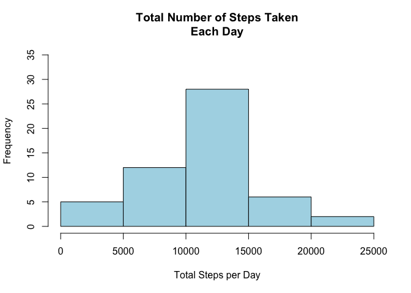
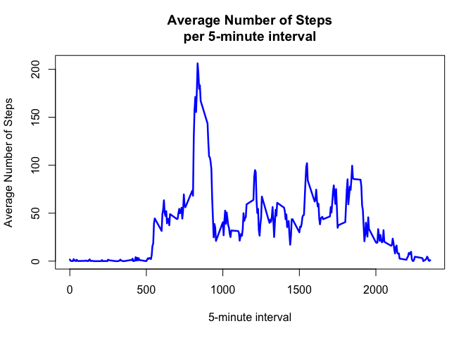
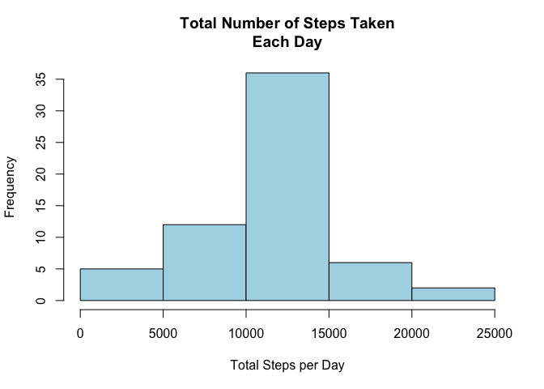
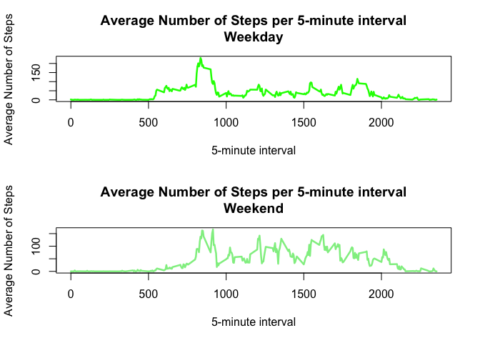

Loading and Preprocessing the Data
----------------------------------

This is where we webscrape the data and store it in our local files.  
**Ensure you have the correct working directory -- the data might be
saved there**

    temp <- tempfile()
    git_hub_data <- "https://github.com/rdpeng/RepData_PeerAssessment1/raw/master/activity.zip"
    download.file(git_hub_data, temp, mode = "wb")
    unzip(temp, "activity.csv")

    df <- read.csv("activity.csv")
    unlink(temp) #stack overflow stated we should unlink the temp file we created

    #need to change the date fields
    df$date <- as.Date(df$date, format = "%Y-%m-%d")

What is the Mean Total Number of Steps Taken per Day?
-----------------------------------------------------

    total_steps_day <- aggregate(steps ~ date, df, sum)
    #total_steps_day$mean_steps <- aggregate(steps ~ date, df, mean)

    hist(total_steps_day[, 2],
         main = "Total Number of Steps Taken\nEach Day",
         xlab = "Total Steps per Day",
         col = "light blue",
         ylim = c(0,35))

    mean(total_steps_day[, 2])

    ## [1] 10766.19

    median(total_steps_day[, 2])

    ## [1] 10765

What is the Average Daily Activity Pattern?
-------------------------------------------

    avg_steps <- aggregate(steps ~ interval, df, mean)
    plot(x = avg_steps[, 1],
         y = avg_steps[, 2],
         type = "l",
         main = "Average Number of Steps\nper 5-minute interval",
         xlab = "5-minute interval",
         ylab = "Average Number of Steps",
         col = "blue",
         lwd = 2.5)

    avg_steps[which(avg_steps[, 2] == max(avg_steps[, 2])), 1]

    ## [1] 835

Imputing Missing Values
-----------------------

    sum(is.na(df$steps))

    ## [1] 2304

    library("stats")

    df$steps_new <- ave(df$steps, df$interval,
                        FUN = function(x) replace(x, is.na(x), mean(x, na.rm = TRUE)))

    df_new <- df[, c(4, 2:3)]

    total_steps_day2 <- aggregate(steps_new ~ date, df_new, sum)

    hist(total_steps_day2[, 2],
         main = "Total Number of Steps Taken\nEach Day",
         xlab = "Total Steps per Day",
         col = "light blue")

    mean(total_steps_day2[, 2])

    ## [1] 10766.19

    median(total_steps_day2[, 2])

    ## [1] 10766.19

Are there Differences in Activity Patterns Between Weekdays and Weekends?
-------------------------------------------------------------------------

    weekdays_factor <- c("Monday", "Tuesday", "Wednesday",
                         "Thursday", "Friday")
    df_new$wk_day <- factor((weekdays(df_new$date) %in% weekdays_factor),
                            levels = c(FALSE, TRUE),
                            labels = c("weekend", "weekday"))

    df_wk_day <- df_new[df_new$wk_day == "weekday", ]
    df_wkend_day <- df_new[df_new$wk_day == "weekend", ]

    avg_steps_wkday <- aggregate(steps_new ~ interval, df_wk_day, mean)
    avg_steps_wkend <- aggregate(steps_new ~ interval, df_wkend_day, mean)

    par(mfrow = c(2,1))

    plot(x = avg_steps_wkday[, 1],
         y = avg_steps_wkday[, 2],
         type = "l",
         main = "Average Number of Steps per 5-minute interval\nWeekday",
         xlab = "5-minute interval",
         ylab = "Average Number of Steps",
         col = "green",
         lwd = 2.5)

    plot(x = avg_steps_wkend[, 1],
         y = avg_steps_wkend[, 2],
         type = "l",
         main = "Average Number of Steps per 5-minute interval\nWeekend",
         xlab = "5-minute interval",
         ylab = "Average Number of Steps",
         col = "light green",
         lwd = 2.5)

